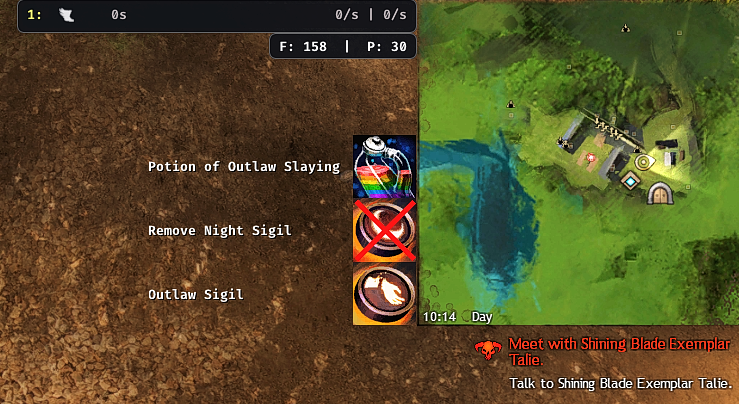

# Prep Alert

A Guild Wars 2 Nexus addon that reminds you when important buffs such as
<sub></sub> Enhancements and
<sub></sub> Sigils are missing.





## Features

In **Dungeons** and **Fractal CMs** these reminders show up dynamically based on your current position.  
They will only show up when the respective buff is missing.

You can also pick which buffs to show, e.g. if you don't care about Slaying Sigils you can disable those reminders.

If no special buffs are available for the current encounter, an alert reminds you to use your build's default buffs.


### A Note on Buff Choices

The buff choices are based on the [Instanced Species List](https://docs.google.com/spreadsheets/d/135Iac7sWfB55kn3kFXWULneu4VfqmK8JqCHCrx3_ZMo/) and focus on general usefulness rather than going for the absolute tryhard setup.  
Let me know if you think something should be changed.

> [!Important]
> WORK IN PROGRESS

<details>
    <summary>Dungeon buffs</summary>

| Map                  | Mode       | Sector                  | Enhancement     | Slaying Sigil | Night Sigil |
| -------------------- | ---------- | ----------------------- | --------------- | ------------- | ----------- |
| Ascalonian Catacombs |            |                         |                 |               |             |
|                      | Story      | All                     | Ghost           | ✅             | ✅           |
|                      | Explorable | Kholer                  | Ghost           | ✅             | ✅           |
| Caudecus's Manor     |            |                         |                 |               |             |
|                      | Story      | All                     | Outlaw          | ✅             |             |
|                      | Explorable | All                     | Outlaw          | ✅             |             |
| Twilight Arbor       |            |                         |                 |               |             |
|                      | Story      | All                     | Nightmare Court | ✅             | ✅           |
|                      | Explorable | All                     | Nightmare Court | ✅             | ✅           |
|                      | Explorable | Up/Fwd Endboss          | Default         |               | ✅           |
|                      | Explorable | Aether                  | Scarlets Armies |               | ✅           |
| Sorrow's Embrace     |            |                         |                 |               |             |
|                      | Story      | All                     | Dredge          | ✅             | ✅           |
|                      | Explorable | P1                      | Inquest         | ✅             | ✅           |
|                      | Explorable | P3 cart                 | Default         |               | ✅           |
|                      | Explorable | P3 endboss              | Destroyer       | ✅             | ✅           |
| Citadel of Flame     |            |                         |                 |               |             |
|                      | Story      | All                     | Flame Legion    | ✅             | ✅           |
|                      | Explorable | All                     | Flame Legion    | ✅             | ✅           |
| Honor of the Waves   |            |                         |                 |               |             |
|                      | Story      | All                     | Sons of Svanir  | ✅             |             |
|                      | Explorable | Entrance Waypoint       | Icebrood        | ✅             |             |
|                      | Explorable | Honor's Voice           | Icebrood        | ✅             |             |
|                      | Explorable | Kodan's Bane            | Icebrood        | ✅             |             |
|                      | Explorable | Aldus Stormbringer (P1) | Sons of Svanir  | ✅             |             |
| Crucible of Eternity |            |                         |                 |               |             |
|                      | Story      | All                     | Inquest         | ✅             |             |
|                      | Explorable | Kudu                    | Default         |               |             |
| Arah                 |            |                         |                 |               |             |
|                      | Explorable | All                     | Undead          | ✅             |             |
|                      | Explorable | Shoggroth (P1)          | Elemental       | ✅             |             |

</details>
<details>
    <summary>Fractal CM buffs</summary>

| Map                   | Sector      | Enhancement     | Slaying Sigil | Night Sigil          |
| --------------------- | ----------- | --------------- | ------------- | -------------------- |
| Lonely Tower          |             |                 |               |                      |
|                       | Lower floor | Default         |               |                      |
|                       | Upper floor | Demon           | ✅             |                      |
| Silent Surf           |             |                 |               |                      |
|                       | All         | Default         |               |                      |
| Sunqua Peak           |             |                 |               |                      |
|                       | All         | Default         |               | (No effect on condi) |
| Shattered Observatory |             |                 |               |                      |
|                       | All         | Default         |               | (Does not work)      |
|                       | Arkk        | Scarlets Armies | ✅ (Inquest)   |                      |
| Nightmare             |             |                 |               |                      |
|                       | All         | Scarlets Armies | ✅ (Serpent)   |                      |
|                       | MAMA        | Scarlets Armies |               |                      |
| Kinfall               |             |                 |               |                      |
|                       | All         | Icebrood        | ✅             |                      |

</details>

## Options

Hovering the `(?)` in-game will show additional information.


## Technical Stuff

The addon is written in C++ 20 for the [Nexus addon platform](https://raidcore.gg/Nexus).  
The scripts for map data fetching and processing are written in Python 3.11+.

### Memory Reading ⚠️

A small portion of the addon relies on memory reading to

- retrieve currently active buffs on the player
- get the current map floor the player is on

Should be safe but as always, use at your own risk.

> [!NOTE]
> In order to keep the addon open source, game client internals were moved to a separate closed-source dependency.  

### Map Data

Data is fetched manually on demand from the GW2 Wiki using `scripts/get-maps.py`.  
The widget [Interactive map data builder](https://wiki.guildwars2.com/wiki/Widget:Interactive_map_data_builder) (more
specifically
the [locator-map-output.js](https://wiki.guildwars2.com/wiki/Widget:Interactive_map_data_builder/locator-map-output.js)
for sector data) provides a reliable source of map information.  
The official API endpoint contains several inconsistencies that make it difficult to use directly.

The retrieved map data is stored in `data/maps_raw.json`.

The data is then processed with `scripts/map_data_patcher/main.py` to generate `src/maps.json` which is then packed into the addon DLL.

#### Sector Data

For dungeon maps the existing sector data was mostly used as-is.  
Fractal maps contain only a single large sector spanning the entire map, so custom sectors were created using a slightly modified version of the wiki’s [Zone Widget](https://wiki.guildwars2.com/wiki/Widget:Zone_map_v3).  
By enabling DevTools local overrides for the main `index.php`, the modifications below were applied to the wiki page directly.

<details>
<summary>Code</summary>

`{{#Widget:Zone map v3 | continent = 2 | map = 1205 | size = huge-map}}`

```javascript
let polygonPoints = [];
let polygonLayer = null;
let tempLineLayer = null;

leaflet_map.on('mousemove', onMapMouseMove);

function onMapClick(e) {
    polygonPoints.push(e.latlng);

    const projected = leaflet_map.project(e.latlng, leaflet_map.getMaxZoom());
    const coords = `[${Math.floor(projected.x)}, ${Math.floor(projected.y)}],`; // python list format

    $(`#${options.container_id} #coordsbox`).val(coords);

    navigator.clipboard.writeText(coords)
        .then(() => console.log('Copied coords:', coords))
        .catch(err => console.error('Error copying coords:', err));

    if (polygonLayer) {
        leaflet_map.removeLayer(polygonLayer);
    }

    if (tempLineLayer) {
        leaflet_map.removeLayer(tempLineLayer);
        tempLineLayer = null;
    }

    if (polygonPoints.length >= 3) {
        polygonLayer = L.polygon(polygonPoints, {color: 'red'}).addTo(leaflet_map);
    } else {
        polygonLayer = L.polyline(polygonPoints, {color: 'red'}).addTo(leaflet_map);
    }
}

function onMapMouseMove(e) {
    if (polygonPoints.length > 0) {
        if (tempLineLayer) {
            leaflet_map.removeLayer(tempLineLayer);
        }

        const lastPoint = polygonPoints[polygonPoints.length - 1];
        tempLineLayer = L.polyline([lastPoint, e.latlng], {color: 'red', dashArray: '4,8'}).addTo(leaflet_map);
    }
}
```

</details>

### Dependencies

- [Nexus](https://raidcore.gg/Nexus)
- [ImGui](https://github.com/ocornut/imgui)
- [nlohmann/json](https://github.com/nlohmann/json)

## Credits

- Raidcore's Nexus addon platform and community (especially Delta)
- The Gw2 Wiki, for a usable map data API and map widgets
- The folks who created the [Instanced Species List](https://docs.google.com/spreadsheets/d/135Iac7sWfB55kn3kFXWULneu4VfqmK8JqCHCrx3_ZMo/)
- Elis, Baste and Bird for support and testing
- The `[TY]` guild, for all the fun we have in dungeons :)
